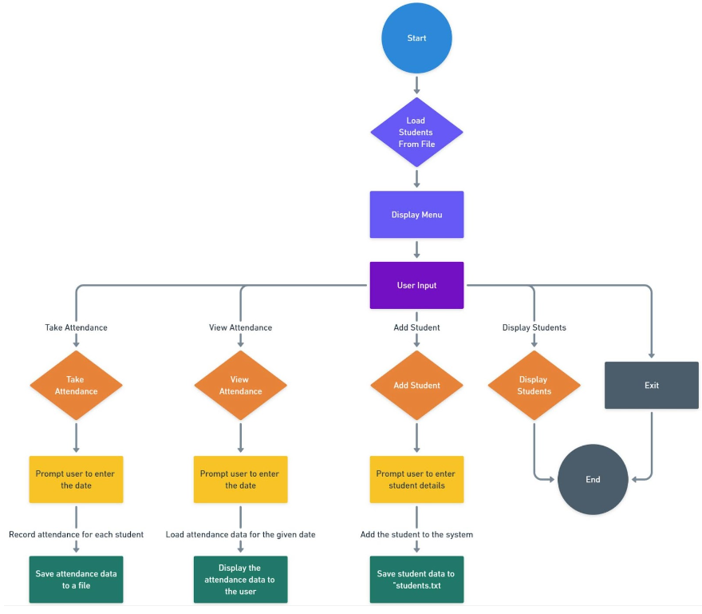
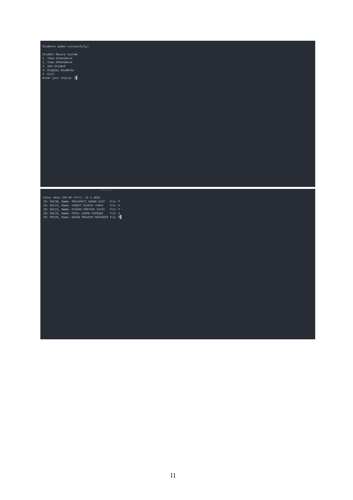
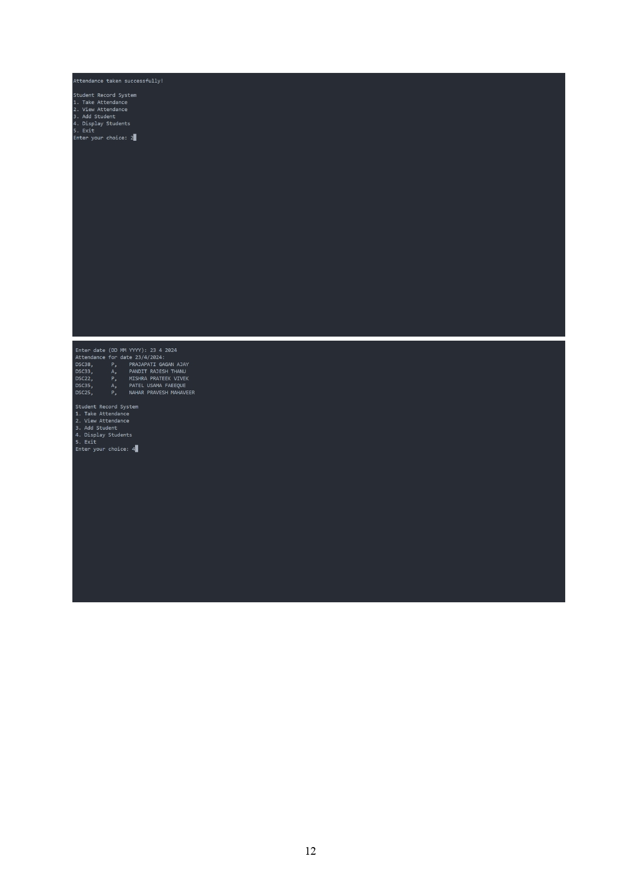
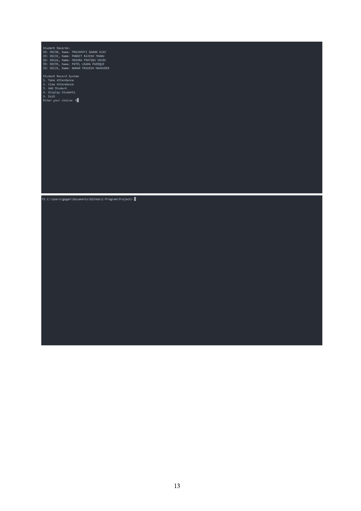
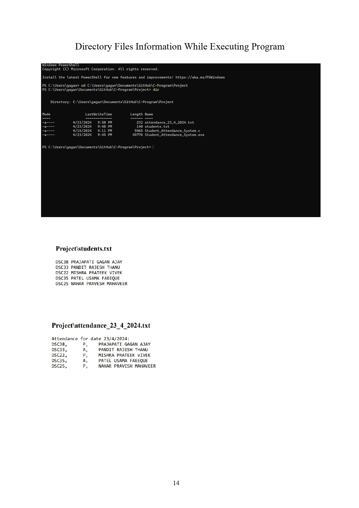

### Youtube Video 

## Students Attendance System

# Mini Project Report

## Table of Contents

| Chapter No. | Chapter                            |
| ----------- | ---------------------------------- |
| 1.          | Introduction                       |
| 2.          | Software And Hardware Requirements |
| 3.          | Flow Chart                         |
| 4.          | Functions Used                     |
| 5.          | Program                            |
| 6.          | Output Snapshots                   |
| 7.          | Conclusion                         |

## Chapter 1

### Introduction

#### Student Attendance System

This program provides functionalities to manage student information
and attendance records. It allows users to add students, take attendance
for specific dates, view attendance records, and display student
information.

The system maintains a database of student details, including unique
IDs and names. Additionally, it facilitates the recording of attendance
by associating each student's attendance status with specific dates.

To ensure ease of use, the system offers a straightforward menu-driven
interface. Users can navigate through different options seamlessly to
perform desired tasks efficiently.

Key Features:

1. Add Student: New students are added to the system along with their
   unique identifiers and names.
2. Take Attendance: Allows users to record student attendance on
   specified dates, storing the data for future reference.
3. View Attendance: Provides the ability to retrieve and display
   attendance records for any given date.
4. Display Students: Allows users to view the list of all registered
   students along with their IDs and names.

The system ensures data integrity by persistently saving student
information and attendance records in text files, enabling seamless
retrieval and management of data across multiple sessions.

To get started, simply select the desired option from the menu and
follow the prompts to perform the corresponding action.

## Chapter 2

### Software And Hardware Requirements

#### Software Requirements:

1. Operating System: The program can run on various operating
   systems, including Windows, macOS, and Linux distributions.
2. Compiler: A C compiler is required to compile and run the C source
   code. Popular choices include GCC (GNU Compiler Collection), Clang,
   and Microsoft Visual C++ Compiler.
3. Text Editor or IDE: You'll need a text editor or an Integrated
   Development Environment (IDE) to write, edit, and manage the source
   code files. Common options include Visual Studio Code, Sublime Text,
   Atom, and IDEs like Visual Studio and Code::Blocks.
4. Terminal or Command Prompt: To compile and execute the program,
   access to a terminal or command prompt is necessary. This allows users
   to navigate to the directory containing the source code files and run the
   compiled executable.

#### Hardware Requirements:

1. Processor: The program's requirements are minimal, and it can run on
   most modern processors without any issues.
2. Memory (RAM): A small amount of RAM is sufficient to run the
   program. Typically, a few megabytes of RAM are adequate for
   compiling and executing the program.
3. Storage: The storage requirements are minimal, as the program itself
   is not resource-intensive. However, some disk space is necessary to
   store the source code files, compiled executables, and any data files
   generated by the program (such as student records and attendance files).
4. Input/Output Devices: Standard input/output devices such as a
   keyboard, mouse, and monitor are required for interacting with the
   program through the command-line interface and viewing the output.

Overall, the Student Record System is lightweight and should run
smoothly on most modern computer systems with minimal software and
hardware resources.

## Chapter 3

### Flowchart

## Chapter 4

### Functions Used

| Standard library functions | Description                                                               |
| -------------------------- | ------------------------------------------------------------------------- |
| `printf()`               | Prints formatted output to the standard output (console)                  |
| `scanf()`                | Reads formatted input from the standard input (keyboard).                 |
| `fgets()`                | Reads a line of text from the standard input (keyboard).                  |
| `fprintf()`              | Writes formatted output to a file.                                        |
| `fopen()`                | Opens a file for reading or writing.                                      |
| `fclose()`               | Closes an open file.                                                      |
| `fscanf()`               | Reads formatted input from a given input stream (usually a file pointer). |
| `sprintf()`              | Writes formatted data to a string.                                        |
| `getchar()`              | Reads a single character from the standard input (keyboard).              |
| `exit()`                 | Terminates the program.                                                   |
| `system()`               | Invokes an operating system command                                       |

| User-Defined Functions     | Description                                                                                               |
| -------------------------- | --------------------------------------------------------------------------------------------------------- |
| `add_date()`             | Prompts the user to enter a date and add it to the dates array.                                           |
| `addStudent()`           | Adds students to the students array, saves them to a file, and updates the num_students counter.          |
| `displayStudents()`      | Displays the list of students stored in the students array.                                               |
| `takeAttendance()`       | Takes attendance for students on a specified date, saves it to a file, and updates the num_dates counter. |
| `viewAttendance()`       | Displays attendance records for a specified date.                                                         |
| `loadStudentsFromFile()` | Loads student data from a file into the students array and updates the num_students counter.              |
| `main()`                 | The main function controls the flow of the program                                                        |

## Chapter 5

### Program

[-&gt; Code Link](https://github.com/Gagan3036/C-Program/blob/main/Project/Student_Attendance_System.c "Code link")

## Chapter 6

### Output Snapshots

## Chapter 7

### Conclusion

The Student Record System presented here offers a comprehensive
solution for managing student information, attendance, and records.
The program enables users to perform various tasks efficiently, such
as adding students, recording attendance, viewing attendance records,
and displaying student information.

Key Features:

1. Modular Design: The code is organized into functions, each serving
   a specific purpose, promoting code readability and maintainability.
2. User-Friendly Interface: The program provides a simple and
   intuitive interface for users to interact with, making it easy to navigate
   and perform tasks.
3. Data Persistence: Student data and attendance records are stored in
   external files, ensuring data persistence across program executions.
4. Error Handling: The system incorporates error handling
   mechanisms to detect and handle errors gracefully, enhancing the
   robustness of the application.
5. Efficient Input Handling: Input validation and buffer-clearing
   techniques are employed to ensure accurate data input and prevent
   input-related issues.

In summary, the Student Record System offers a reliable and
user-friendly platform for managing student information and
attendance efficiently. With its well-structured design and
functionality, it caters to the needs of educational institutions and
organizations seeking to streamline their administrative tasks related
to student management.
